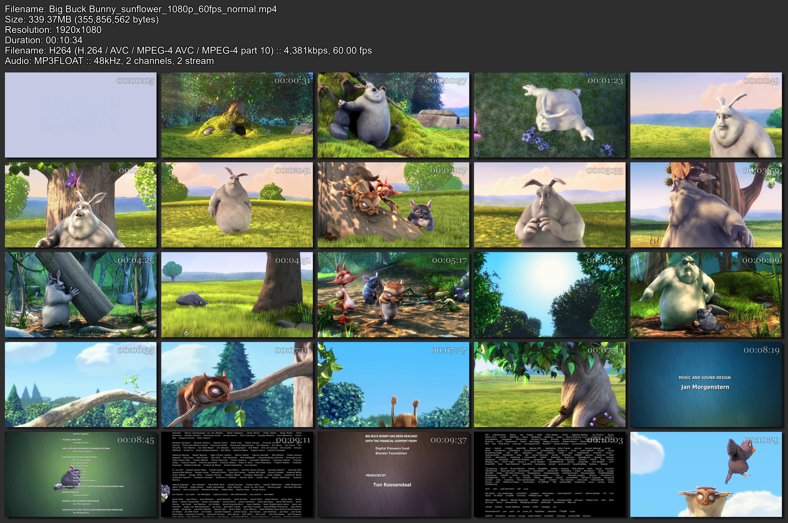

# Video Thumbnail Generator

This Python script generates video thumbnails with a customizable grid layout and additional features like text
overlays. It uses the **Pillow (PIL)** library for image processing and **PyAV** for video frame extraction.

---

## Features

- **Thumbnail Customization**
    - Configure the number of images per row and column.
    - Flexible Output Options: Save the generated thumbnails in various image modes (e.g., RGB or RGBA).
    - Set background color for the thumbnail grid.
    - Customize font style, size, and color for text overlays.
    - Customize outline, shadow color

- **Library Support**
    - **PyAV** for video decoding and frame extraction.
    - **Pillow (PIL)** for creating and editing images.

---

## Installation

1. **Clone the Repository**
   ```bash
   git clone https://github.com/berg-1/thumbnail-generator.git
   cd thumbnail-generator
   ```

2. **Install Dependencies**  
   Ensure you have Python installed (>= 3.8). Then, install the required libraries:
   ```bash
   pip install pillow av
   ```

---

## Usage

Run the script using the command line:
```bash
python thumbnail_generator.py <video_path> [options]
```

### Positional Arguments

- **`<video_path>`**: Path to the video file or folder containing video files.

### Optional Arguments

| Argument                   | Default Value       | Description                                 |
|----------------------------|---------------------|---------------------------------------------|
| `-r`, `--rows`             | 3                   | Number of rows in the thumbnail grid.       |
| `-c`, `--cols`             | 3                   | Number of columns in the thumbnail grid.    |
| `-b`, `--bg-color`         | `#2E2E2E`           | Background color of the grid.               |
| `-f`, `--text-font`        | `arial.ttf`         | Font file for text overlays.                |
| `-ft`, `--time-font`       | `fonts/Georgia.ttf` | Font file for timestamp overlays.           |
| `-c1`, `--text-color`      | `#FBFBFDFF`         | Color for text overlays.                    |
| `-c2`, `--time-color`      | `#FFFFFF99`         | Color for timestamp overlays.               |
| `-ol`, `--outline`         | `#00000040`         | Color of the thumbnail outline.             |
| `-s`, `--shadow-color`     | `#12121266`         | Color for shadow effects.                   |
| `-sb`, `--shadow-bg-color` | `#2E2E2E`           | Background color for shadow effects.        |
| `-m`, `--output-mode`      | `RGB`               | Output mode for images (e.g., RGB for JPG). |
| `-o`, `--output`           | `None`              | Path to save the generated thumbnail grid.  |

### Example Commands

1. **Generate a default grid for a single video file:**

   ```bash
   python thumbnail_generator.py "sample_video.mp4"
   ```

2. **Generate a 4x5 grid with custom fonts and save as PNG:**

   ```bash
   python thumbnail_generator.py "sample_video.mp4" -r 4 -c 5 --bg-color='#000000' -m RGBA -o "output.png"
   ```

3. **Process all videos in a folder:**

   ```bash
   python thumbnail_generator.py "videos_folder"
   ```

### Sample output



## License

This project is licensed under the MIT License. See the `LICENSE` file for details.

---

## Contributing

Feel free to fork this repository, submit issues, or create pull requests to improve the script.

------

Happy Thumbnailing! 🎥📸